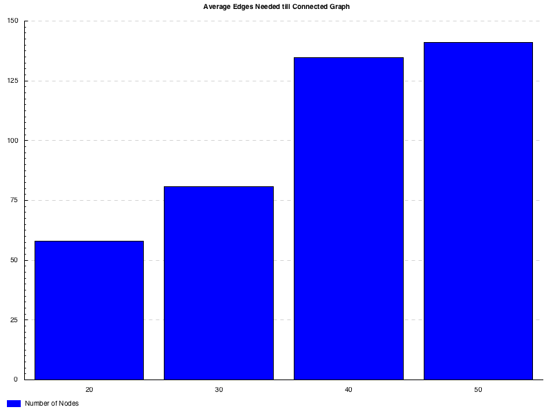
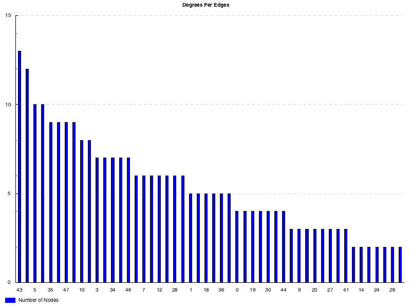
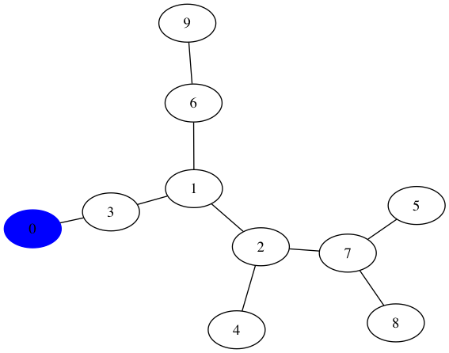
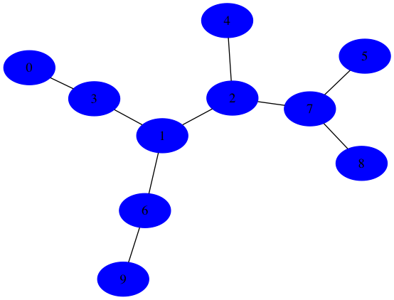
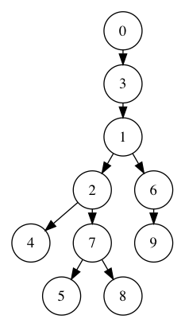

# sdc-graph

## Description
Class exercise regarding the random generation of connected graphs and their Breadth-First traversal, with benchmarks.

## Dependencies
* Haskell `stack` tool.

## Build
* `cd` to project directory;
* Run `stack setup` (you only have to do this once);
* Run `stack build`.

## Execute
* `cd` to project directory;
* Run `stack exec graph`.

## Available Commands
* `help`
* `random [scale] [upperbound]` - run random algorithm up to `upperbound` with `scale` spacing
* `pref [scale] [upperbound]` - run preferencial attachment algorithm up to `upperbound` with `scale` spacing
* `bfs [pref/random] [nr_of_nodes] [start_node]` - run bfs, starting on *start_node*, on graph generated with pref/random algorithm composed by *nr_of_nodes* nodes
* `exit`

## Usage examples
```
command:
> pref 10 50
```

Result:




--------

```
command:
> bfs pref 0 10
```

Result:

Step 0



## (...)

Final Step



Resulting Tree

