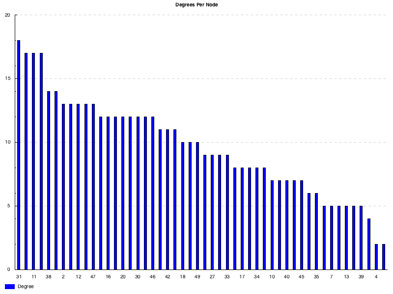

# sdc-graph

## Description
Class exercise regarding the random generation of connected graphs, with benchmarks.

## Dependencies
* Haskell `stack` tool.

## Build
* `cd` to project directory;
* Run `stack build`.

## Execute
* `cd` to project directory;
* Run `stack exec graph`.

## Available Commands
* `help`
* `random [scale] [upperbound]` - run random algorithm up to `upperbound` with `scale` spacing
* `pref [scale] [upperbound]` - run preferencial attachment algorithm up to `upperbound` with `scale` spacing
* `exit`

## Usage examples
```
command:
> pref 10 50
```
Result:

